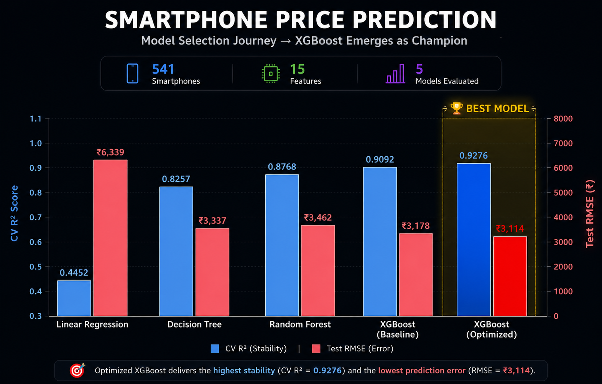

# 📱 Feature Extraction and Price Prediction for Mobile Phones


---

> **⚠️ EVALUATION NOTICE:**
> The core analytical methodologies, model interpretations, and business insights are detailed
> explicitly in the presentation's **Speaker Notes**. Please download the raw
> [Mobile_Price_Prediction_Presentation](./Mobile_Price_Prediction_Presentation.pptx) file
> to access the full analytical breakdown.

---

<p align="center">
  
</p>
<p align="center"><i>Model Selection Dashboard — XGBoost Optimized emerges as champion with CV R² = 0.9276</i></p>

---

## 📌 Project Overview

**Mobile Phone Price Prediction** is a complete end-to-end machine learning pipeline that predicts smartphone retail prices from hardware specifications. The project goes beyond basic model training — applying a three-method feature screening process, controlled empirical experiments to resolve conflicting signals, and dual-method importance validation to produce findings that are evidence-backed at every step.

The central business question driving this project:

> *"Which hardware specifications drive mobile phone prices — and can we predict price accurately from specs alone?"*

Both questions are answered with quantitative evidence. The final tuned XGBoost model explains **92.76% of price variance on unseen data**, with **84.4% of predictions falling within ±10% of actual price**.

---

## 🎯 Project Objectives

- Perform thorough data preprocessing and handle all structural inconsistencies in the raw dataset
- Engineer meaningful features from raw specification strings (camera MP, processor brand, colour family)
- Identify the most influential hardware features using three complementary screening methods
- Build and evaluate four machine learning models under identical, controlled conditions
- Optimize the winning model through systematic hyperparameter tuning via GridSearchCV
- Validate model reliability through residual analysis and a Feature Contribution Test
- Provide actionable, evidence-backed business recommendations for pricing strategy

---

## ❓ Key Business Questions

1. Which hardware specification has the strongest influence on mobile phone price?
2. Do non-linear relationships exist that linear analysis cannot detect?
3. Which machine learning approach best captures the pricing dynamics of this market?
4. How reliable are the model's predictions for real-world pricing decisions?
5. What concrete actions should the organization take based on these findings?

---

## 🚀 Analytical Pipeline — The 11-Section System

### 🔍 Sections 01–02 — Problem Understanding & Data Inspection
Establishing the business context and performing an initial structural audit of the 541-device dataset.
- **Business framing:** Defined the pricing problem and identified what success looks like
- **Data inspection:** Confirmed 541 rows × 12 columns, identified type mismatches and string-encoded numerics requiring extraction

### 🧹 Section 03 — Data Preprocessing
Complete transformation from raw, inconsistent data to a model-ready feature set.
- **Zero missing values, zero duplicates** confirmed across all 541 records
- **Feature Engineering:** Extracted numeric MP values from camera strings; extracted Processor Brand from full processor name strings; grouped individual model names into brand categories; grouped colour variants into base colour families
- **Outlier Treatment:** IQR-based capping applied — no rows deleted, all 541 retained
- **Encoding:** Label Encoding for Model and Colour; One-Hot Encoding for Processor Brand (6 binary columns)
- **Output:** 541 × 18 EDA-ready dataset

### 📊 Section 04 — Exploratory Data Analysis
Three-layer visual analysis uncovering the pricing dynamics in this market.
- **Univariate:** Price distribution (right-skewed), RAM/Storage tier counts, brand and colour family pie charts
- **Bivariate:** Price vs RAM, Memory, AI Lens boxplots; Average price by brand category; Processor brand distribution
- **Multivariate:** Correlation heatmap, interaction analysis across feature combinations
- **Output:** Matrix reduced to 541 × 16 after dropping EDA-exclusive columns (`Model_Category`, `Colour_Category`).

### 🔬 Section 05 — Feature Extraction & Selection
The most analytically rigorous section — three independent screening methods applied and conflicts resolved empirically.
- **Method 1:** Pearson Correlation ranking (linear signal with Price)
- **Method 2:** SelectKBest F-test (statistical significance, p < 0.05 threshold)
- **Method 3:** Random Forest Screening (non-linear signal strength, RF gain score ≥ 0.01)
- **Triangulation:** Three-method comparison table built to identify consensus features and explicitly flag analytical conflicts.
- **Empirical experiments:** Conducted custom retention tests for all three conflicting features (`Model_Encoded`, `Battery_mAh`, `AI Lens`)
- **Feature Contribution Test:** Confirmed `Model_Encoded` is strictly necessary — its removal collapsed CV R² from 0.9276 to 0.6212.
- **Output:** 4 mathematically weak features dropped. Final optimized dataset locked at **541 × 12 (11 predictive features + 1 Target variable)**.

### 🏁 Section 06 — Model Building & Optimization — The Race
Four models trained under identical conditions, progressing from simplest to most complex.

| # | Model | Type | CV R² |
|---|---|---|---|
| 1 | Linear Regression | Baseline | 0.4452 |
| 2 | Decision Tree | Rule-based | 0.8257 |
| 3 | Random Forest | Bagging Ensemble | 0.8768 |
| 4 | XGBoost | Boosting Ensemble | 0.9092 |

XGBoost selected as champion → **GridSearchCV** applied (54 parameter combinations × 5-fold CV = **270 total fits**).

**Winning hyperparameters:** `learning_rate: 0.1` | `max_depth: 5` | `n_estimators: 300` | `subsample: 0.8`

### 📊 Section 07 — Model Comparison Dashboard
Full side-by-side comparison of all five model configurations across MAE, RMSE, R², and CV R² — with interactive Plotly visualizations and winner declaration.

### 🔍 Section 08 — Feature Importance Analysis
Two independent post-model methods cross-validating which features the champion model relies on.
- **Built-in XGBoost Importance** (gain-based): Front_Camera_MP dominates at 57% weight
- **Permutation Importance** (R² drop on shuffling): Confirms top-3 — Front_Camera_MP (0.368), Battery_mAh (0.183), Model_Encoded (0.169)
- **Two-method synthesis** resolving RAM vs Memory divergence and confirming processor brand columns as negligible

### 🎯 Section 09 — Final Model: Retraining, Predictions & Validation
- **Full retraining** on 100% of data (541 samples) using confirmed hyperparameters
- **Feature Contribution Test:** Removing Model_Encoded → CV R² collapses from 0.9276 to 0.6212 (−30 points)
- **Sample predictions** on 5 representative phone profiles (Entry → Flagship)
- **Residual analysis** confirming no systematic bias — 84.4% within ±10% accuracy

### 💼 Section 10 — Business Recommendations
Six evidence-backed recommendations directly traceable to specific analytical findings — covering camera strategy, battery positioning, brand consistency, tier anchoring, model deployment, and processor brand signaling.

### 📋 Section 11 — Conclusion & Future Scope
Full project synthesis and six future directions including explicit brand features, dataset expansion, temporal pricing data, advanced ensembles, an interactive analytical tool, and pricing API deployment.

---

## 📈 Key Findings

- **Front camera is the #1 price driver** — 57% of XGBoost's total decision weight. Non-linear signal completely missed by correlation analysis.
- **Battery capacity operates non-linearly** — ranked last in linear methods yet 2nd in both importance methods. Threshold effects invisible to statistical tests.
- **Model name carries pricing power** — beyond hardware specs alone. Removing it collapses generalization stability by 30 percentage points.
- **Boosting beats bagging** — XGBoost CV R² 0.9276 vs Random Forest 0.8768 on this dataset.
- **Linear Regression CV R² = 0.4452** — confirming pricing relationships in this market are fundamentally non-linear.
- **84.4% of predictions within ±10% error** — median error of just 1.2%, production-ready for the ₹5,000–₹40,000 segment.

---

## 🏆 Final Model Performance

| Metric | Value |
|---|---|
| Mean Absolute Error (MAE) | ₹964 |
| Root Mean Squared Error (RMSE) | ₹3,114 |
| Test R² | 0.8926 |
| **Cross-Validation R² (5-fold)** | **0.9276** |
| Within ±10% Error | 84.4% of predictions |
| Within ±20% Error | 91.7% of predictions |
| Median Absolute % Error | 1.2% |

---

## 🗂️ Repository Structure

```
Mobile-Price-Prediction/
│
├── Assets/
│   ├── Processed_Flipdata.csv                    # Source dataset (541 rows × 12 columns)
│   └── hero_image_dashboard.png                  # Model selection dashboard (hero image)
│
├── mobile_price_prediction.ipynb                 # Main analysis notebook (11 sections)
├── Mobile_Price_Prediction_Presentation.pptx     # Project presentation
├── requirements.txt                              # Python dependencies
└── README.md                                     # This file
```

---

## 📂 Dataset Overview

| Property | Detail |
|---|---|
| **File** | `Processed_Flipdata.csv` |
| **Records** | 541 mobile devices |
| **Original Features** | 12 columns |
| **After Preprocessing** | 18 columns (12 − 3 dropped + 9 engineered) |
| **Final Model Features** | 11 (after feature screening) |
| **Target Variable** | `Price` (INR) |
| **Price Range** | ₹2,000 — ₹60,000+ |

### Dataset Dictionary (Raw Input)

| Column | Type | Description |
|---|---|---|
| `Model` | Text | Mobile phone model name |
| `Colour` | Text | Available colour variant |
| `Memory` | Integer | Internal storage capacity (GB) |
| `RAM` | Integer | RAM size (GB) |
| `Battery_` | Text | Battery capacity string — extracted to `Battery_mAh` |
| `Rear Camera` | Text | Rear camera resolution string — extracted to `Rear_Camera_MP` |
| `Front Camera` | Text | Front camera resolution string — extracted to `Front_Camera_MP` |
| `AI Lens` | Integer | Presence of AI lens (1 = Yes, 0 = No) |
| `Mobile Height` | Float | Physical height of the device (mm) |
| `Processor_` | Text | Full processor name string — extracted to `Processor_Brand` |
| `Prize` | Text | Selling price in INR — cleaned and renamed to `Price` |

### Engineered Features

| Feature | Description |
|---|---|
| `Battery_mAh` | Numeric battery capacity extracted from string |
| `Rear_Camera_MP` | Rear camera megapixels extracted from string |
| `Front_Camera_MP` | Front camera megapixels extracted from string |
| `Processor_Brand` | Brand extracted from full processor string (Mediatek, Qualcomm, Unisoc, Exynos, Google, Unknown) |
| `Model_Category` | Brand family grouped from model name — EDA use only, not fed to model |
| `Colour_Category` | Base colour family grouped from colour variant — EDA use only, not fed to model |
| `Model_Encoded` | Label-encoded individual model name (feeds model) |
| `Colour_Encoded` | Label-encoded individual colour variant (feeds model) |
| `Proc_[Brand]` | One-hot encoded processor brand columns — 6 binary columns |

---

## 📦 Library Architecture

| Library | Version | Project Purpose |
|---|---|---|
| `pandas` | 2.2.3 | Data manipulation, DataFrame structuring, and aggregation |
| `numpy` | 2.2.0 | Mathematical operations, array handling, and statistical calculations |
| `matplotlib` | 3.10.0 | Core plotting and static chart rendering |
| `seaborn` | 0.13.2 | Statistical visualizations — heatmaps, boxplots, distribution plots |
| `scipy` | 1.15.0 | Skewness, kurtosis, Q-Q plots, and statistical profiling |
| `scikit-learn` | 1.6.1 | Preprocessing, feature selection, Linear/Tree/RF models, GridSearchCV, permutation importance |
| `plotly` | 5.24.1 | Interactive model comparison dashboard and feature importance charts |
| `xgboost` | 2.1.4 | Winning model — gradient boosting with hyperparameter optimization |
| `jupyter` | 1.1.1 | Notebook environment |

---

## 💻 Installation & Setup

### Prerequisites
Ensure **Python 3.10+** is installed on your system.

---

### Option 1: Google Colab *(Recommended — Zero Setup)*

1. Upload `mobile_price_prediction.ipynb` to your Colab session.
2. The notebook will automatically fetch `Processed_Flipdata.csv` from GitHub if not found locally.
3. Run all cells. Install kaleido separately:
```python
!pip install kaleido
```

---

### Option 2: Local Jupyter Environment

**1. Clone the repository:**
```bash
git clone https://github.com/S-Yousuf-S/NHIS_Project4.git
cd NHIS_Project4
```

**2. Create a virtual environment:**
```bash
python -m venv MPP_ENV
```

**3. Activate the environment:**

Windows:
```bash
MPP_ENV\Scripts\activate
```

macOS / Linux:
```bash
source MPP_ENV/bin/activate
```

**4. Install dependencies:**
```bash
pip install -r requirements.txt
```

**5. Launch the notebook:**
```bash
jupyter notebook mobile_price_prediction.ipynb
```

> **Note:** Run all cells top to bottom. GridSearchCV in the Model Building section tests 270 parameter combinations — estimated runtime of 2–3 minutes. `n_jobs=-1` is already configured to use all available CPU cores.

---

## 🙋 Frequently Asked Questions

**Q: Why were Model_Category and Colour_Category created if they don't feed the model?**

**A:** These grouped categories exist purely for EDA visualization — specifically the brand distribution pie chart and average price by brand chart. The actual model uses the more granular Model_Encoded and Colour_Encoded features which encode individual model names and colour variants, not brand families. Grouped
categories are more readable in charts but lose the fine-grained pricing signal that individual model encoding captures. Both are dropped during EDA Cleanup
before modeling begins.

---

**Q: Why does the model use Label Encoding for Model and Colour instead of One-Hot Encoding?**

**A:** Model has 187 unique values and Colour has over 50. One-Hot Encoding either of these would add 187+ binary columns to the dataset — far more columns than the 541 rows available, causing the curse of dimensionality and making the model unstable. Label Encoding keeps each as a single integer column. Processor Brand, by contrast, has only 6 categories — manageable for One-Hot Encoding, which avoids imposing a false ordinal relationship between brands.

---

**Q: Why was IQR capping used for outliers instead of removing them?**

**A:** Removing outliers on a 541-row dataset would delete potentially 30–50 rows — a significant loss of information. IQR capping retains all 541 devices while reducing the influence of extreme values by capping them at the boundary rather than deleting them. This preserves the full dataset size while still preventing outliers from distorting model training.

---

**Q: Is processor brand not important for pricing?**

**A:** In this dataset, processor brand alone is not a reliable independent price signal. All four processor brand columns ranked in the Negligible tier in Feature Importance Analysis, with Proc_Qualcomm and Proc_Unisoc showing slightly negative permutation importance scores — meaning their presence marginally harmed generalization on unseen data.

---

**Q: Why were only 4 models compared instead of testing more options like SVM or Neural Networks?**

**A:** The four models were chosen to form a deliberate complexity ladder — Linear Regression (linear baseline), Decision Tree (non-linear, rule-based), Random Forest (bagging ensemble), XGBoost (boosting ensemble). Each model answers a specific question about the data's structure. Adding SVM or Neural Networks would extend the runtime significantly (SVM scales poorly with mixed feature types; Neural Networks require far more data than 541 rows to generalize reliably) while adding complexity that isn't justified by the project's scope. The four-model ladder already answers the core question decisively — XGBoost's CV R² of 0.9276 leaves little room for improvement that would justify the added complexity.

---

**Q: Why was XGBoost chosen over Random Forest?**

**A:** Both were evaluated under identical conditions. XGBoost's sequential error-correction (boosting) outperformed Random Forest's parallel averaging (bagging) — CV R² of 0.9276 vs 0.8768. The non-linear, mixed-signal nature of this dataset favours XGBoost's approach of iteratively correcting residuals tree-by-tree.

---

**Q: Why were three feature screening methods used instead of one?**

**A:** Each method detects a different type of relationship. Correlation detects linear signal; SelectKBest measures statistical significance; Random Forest screening detects non-linear patterns. Two features — Battery_mAh and Model_Encoded — appeared irrelevant to linear methods but critical to the tree-based screen. Controlled empirical experiments confirmed both genuinely improve model performance when retained. A single method would have incorrectly recommended dropping both.

---

**Q: Why was the final model retrained on 100% of the data?**

**A:** The 80/20 train-test split was used during evaluation to measure generalization to unseen data. Once GridSearchCV confirmed the optimal hyperparameters, the test set had served its purpose. Retraining on all 541 samples gives the deployed model maximum exposure to pricing patterns across the full dataset.

---

**Q: What does Cross-Validation R² measure and why does it matter more than Test R²?**

**A:** Test R² measures performance on one specific held-out split — it can be lucky or unlucky depending on which 20% of devices ended up in the test set. Cross-Validation R² averages performance across 5 different splits of the data, giving a much more reliable estimate of how the model will perform on truly new, unseen data. A model with high Test R² but low CV R² is overfitting to one lucky split. A model with CV R² = 0.9276 means it consistently explains 92.76% of price variance regardless of which devices it's evaluated on.

---

**Q: What is a Feature Contribution Test and how is it different from feature importance?**

**A:** Feature importance scores (from built-in XGBoost or permutation testing) tell you how much each feature contributed during training. A Feature Contribution Test goes further — it removes a specific feature entirely, retrains the model, and directly measures the performance change. It's a controlled before-and-after experiment rather than an inference from training weights. In this project, the Feature Contribution Test for Model_Encoded revealed a CV R² collapse from 0.9276 to 0.6212 — a finding that importance scores alone would not have revealed with the same clarity.

---

**Q: Why does the Flagship sample prediction show a lower price than Upper Mid?**

**A:** Model_Encoded is label-encoded alphabetically by individual model name — not by brand tier or price hierarchy. The model cannot infer "flagship" from spec values alone. This reflects a genuine pattern in the dataset: flagship-spec devices from budget brands are priced below mid-range devices from premium brands. The model has learned this market reality accurately.

---

## 🎯 Conclusion

This project demonstrates that a rigorous, evidence-driven ML pipeline can accurately predict mobile phone prices from hardware specifications — with no manual pricing judgment required. Every analytical decision, from which features to retain to which model to deploy, is backed by measurable evidence rather than assumption.

The most counterintuitive finding: **front camera quality matters more than RAM, storage, or processor brand** when predicting price. The second most counterintuitive: **battery capacity appears irrelevant in linear analysis but ranks 2nd in importance once non-linear methods are applied.** Both findings required the three-method screening approach to surface — a single method would have missed at least one of them.

---

## 👤 Author

**Yousuf S. R. Sakkaf**

GitHub: [S-Yousuf-S](https://github.com/S-Yousuf-S/NHIS_Project4)

---

⭐ *If you found this analysis insightful, consider starring the repository!*
