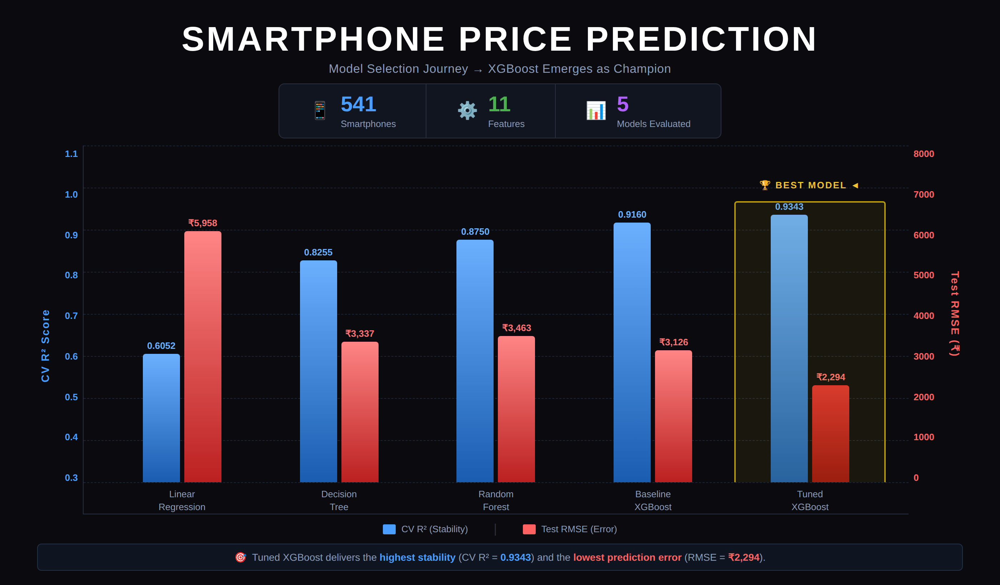

# 📱 SMARTPHONE PRICE PREDICTION


---

### **From Data Exploration to Business Recommendations**

An end-to-end machine learning project that predicts smartphone retail prices from hardware specifications while uncovering the key factors that drive pricing decisions. The project combines rigorous data preparation, exploratory analysis, feature engineering, statistical validation, machine learning, and business interpretation into a single reproducible workflow.

Rather than treating prediction as the final objective, this notebook focuses on understanding **why** prices vary across devices and translating those findings into practical recommendations for pricing strategy and product positioning.

---

> **⚠️ EVALUATION NOTICE:**
> The core analytical methodologies, model interpretations, and business insights are detailed
> explicitly in the presentation's **Speaker Notes**. Please download the raw
> [Smartphone_Price_Prediction_Presentation](./Smartphone_Price_Prediction_Presentation_YS.pptx) file
> to access the full analytical breakdown.

---

<p align="center">
  
</p>
<p align="center"><i>End-to-end machine learning workflow for smartphone price prediction and business insight generation.</i></p>

---

## 📌 Project Overview

Smartphone prices are influenced by multiple interacting hardware characteristics rather than a single specification. Memory, cameras, battery capacity, processor family, and brand positioning all contribute differently across price segments, making manual pricing difficult and often inconsistent.

This project develops a complete machine learning pipeline capable of estimating smartphone prices directly from their specifications while identifying which features genuinely influence market value.

Starting from raw marketplace data, the notebook performs:

- Data quality assessment and preprocessing
- Feature engineering from textual specifications
- Exploratory Data Analysis (EDA)
- Statistical feature evaluation
- Machine learning model comparison
- Hyperparameter optimization
- Model interpretation and validation
- Business recommendation generation

The analysis is driven by one central business question:

> **Can smartphone prices be accurately predicted from hardware specifications, and what insights can manufacturers or retailers use to improve pricing decisions?**

Instead of presenting only predictive performance, the notebook explains the reasoning behind every analytical decision, ensuring that each conclusion is supported by measurable evidence.

---

## 🎯 Project Objectives

This project aims to:

- Build a complete end-to-end regression pipeline using real smartphone market data.
- Transform raw hardware specifications into a clean, machine-learning-ready dataset.
- Engineer meaningful numerical and categorical features from unstructured text.
- Explore pricing behaviour through statistical and visual analysis.
- Compare multiple regression algorithms under identical experimental conditions.
- Improve model performance through systematic hyperparameter tuning.
- Interpret the final model using feature importance techniques.
- Validate prediction reliability through residual and error analysis.
- Translate analytical findings into actionable business recommendations.

---

## ❓ Key Business Questions

The notebook investigates the following business questions:

1. Which smartphone specifications have the greatest impact on retail price?
2. Can hardware specifications alone provide reliable price predictions?
3. Which regression algorithm best captures smartphone pricing behaviour?
4. Which engineered features contribute most to predictive performance?
5. How reliable are the model's predictions on unseen devices?
6. How can these findings support pricing strategy and product positioning?

---

## 🚀 Analytical Workflow

The notebook follows an end-to-end analytical pipeline consisting of eleven major sections. Each stage builds upon the previous one, transforming raw smartphone specifications into an interpretable machine learning solution with actionable business recommendations.

| Section | Purpose |
|----------|---------|
| **01. Understanding the Problem and the Data** | Define the business objective, understand the pricing problem, and introduce the dataset used throughout the analysis. |
| **02. Importing and Inspecting the Data** | Load the dataset, inspect its structure, verify data quality, and identify inconsistencies requiring preprocessing. |
| **03. Data Preprocessing** | Clean the raw data, engineer new features, perform integrity checks, and prepare a modelling-ready dataset. |
| **04. Exploratory Data Analysis** | Explore feature distributions, identify trends, analyse relationships between variables, detect outliers, and prepare the dataset for modelling. |
| **05. Feature Extraction & Selection** | Evaluate predictor variables using statistical tests, model-based screening, and empirical validation to determine the optimal feature set. |
| **06. Model Building & Tuning — The Race** | Train multiple regression algorithms under identical conditions, compare their performance, and optimise the best-performing model using GridSearchCV. |
| **07. Model Comparison Dashboard** | Summarise model performance through interactive visualisations and comparative evaluation metrics. |
| **08. Feature Importance Analysis** | Interpret the final model using built-in feature importance and permutation importance to understand which variables drive predictions. |
| **09. Final Model — Retraining, Predictions & Validation** | Retrain the best model using the complete dataset, generate sample predictions, and validate performance through residual analysis. |
| **10. Business Recommendations** | Translate analytical findings into practical recommendations for pricing strategy, product positioning, and decision-making. |
| **11. Conclusion & Future Scope** | Summarise the project outcomes, discuss limitations, and propose opportunities for future improvements. |

The workflow intentionally follows the complete lifecycle of an applied machine learning project—from understanding the business problem to delivering explainable predictions and evidence-based business recommendations.

---

## 📂 Dataset Overview

| Property | Detail |
|---|---|
| **Dataset** | `Processed_Flipdata.csv` |
| **Records** | 541 smartphones |
| **Original Features** | 12 columns |
| **Target Variable** | `Price` (INR) |
| **Prediction Type** | Supervised Regression |

The dataset contains smartphone hardware specifications collected from the retail market. Several variables are stored as textual specifications and require preprocessing before they can be used for statistical analysis or machine learning.

---

### Raw Dataset Dictionary

| Column | Type | Description |
|---|---|---|
| `Unnamed: 0` | Integer | Row index column present in the original dataset (removed during preprocessing) |
| `Model` | Text | Smartphone model name |
| `Colour` | Text | Available colour variant |
| `Memory` | Integer | Internal storage (GB) |
| `RAM` | Integer | RAM size (GB) |
| `Battery_` | Text | Battery capacity string |
| `Rear Camera` | Text | Rear camera specification |
| `Front Camera` | Text | Front camera specification |
| `AI Lens` | Integer | AI Lens availability (0 / 1) |
| `Mobile Height` | Float | Device height (mm) |
| `Processor_` | Text | Full processor description |
| `Prize` | Text | Smartphone selling price (renamed to `Price`) |

---

### Engineered Features

| Feature | Description |
|---|---|
| `Battery_mAh` | Battery capacity extracted from text |
| `Rear_Camera_MP` | Rear camera resolution extracted from text |
| `Front_Camera_MP` | Front camera resolution extracted from text |
| `Processor_Brand` | Processor manufacturer extracted from processor description |
| `Model_Category` | Smartphone brand grouping (EDA only) |
| `Colour_Category` | Colour family grouping (EDA only) |
| `Model_Encoded` | Label-encoded smartphone model |
| `Colour_Encoded` | Label-encoded colour variant |
| `Proc_[Brand]` | One-hot encoded processor brand columns |

---

## 🧹 Data Preprocessing

The preprocessing pipeline transforms the raw smartphone specifications into a modelling-ready dataset.

Major preprocessing tasks include:

- Data quality verification
- Feature engineering from textual specifications
- Outlier treatment using the IQR method
- Categorical feature encoding
- Final dataset validation

**Output:** Clean dataset prepared for exploratory analysis and machine learning.

---

## 📊 Exploratory Data Analysis

EDA is organised into three complementary stages.

#### 🔹 Univariate Analysis

- Price distribution and skewness
- RAM and Memory distributions
- Smartphone brand distribution
- Colour family distribution
- Processor brand distribution
- Mobile Height Validation
- Outlier detection

#### 🔹 Bivariate Analysis

- Price vs RAM
- Price vs Memory
- Price vs AI Lens
- Average smartphone price by brand
- Processor brand distribution

#### 🔹 Multivariate Analysis

- Correlation heatmap

**Output:** Dataset prepared for feature selection and predictive modelling.

---

## 🔬 Feature Extraction & Selection

Rather than relying on a single technique, feature selection combines multiple complementary methods before finalising the modelling dataset.

The notebook evaluates features using:

- Pearson Correlation
- SelectKBest (F-Test)
- Random Forest Feature Importance

Features producing conflicting results are further validated through empirical experiments before the final feature set is confirmed.

**Output:** Optimised feature set used for model development.

---

## 🏁 Model Building & Tuning — The Race

Four regression algorithms are trained and evaluated under identical experimental conditions to ensure a fair comparison. The models progress from a simple linear baseline to increasingly sophisticated ensemble methods, allowing improvements in predictive performance to be assessed systematically.

| Model | Type | Purpose |
|---|---|---|
| **Linear Regression** | Linear Baseline | Establish a benchmark for linear relationships |
| **Decision Tree Regressor** | Tree-Based | Capture non-linear decision boundaries |
| **Random Forest Regressor** | Bagging Ensemble | Improve prediction stability through ensemble learning |
| **XGBoost Regressor** | Boosting Ensemble | Sequentially minimise prediction errors |

The best-performing baseline model is subsequently optimised using **GridSearchCV** before being selected as the final production model.

---

### ⚙️ Hyperparameter Optimization

To improve model generalisation, the winning XGBoost model undergoes systematic hyperparameter optimisation using **GridSearchCV**.

The optimisation process evaluates **162 hyperparameter combinations**, resulting in **810 model fits** through **5-fold Cross-Validation** before selecting the optimal model configuration.

#### Final Optimized Hyperparameters

| Hyperparameter | Value |
|---|---:|
| `colsample_bytree` | 0.8 |
| `learning_rate` | 0.2 |
| `max_depth` | 5 |
| `n_estimators` | 300 |
| `subsample` | 0.8 |

---

## 📊 Model Comparison Dashboard

All models are evaluated using identical train-test splits and the same performance metrics to ensure an unbiased comparison.

| Model | Test MAE | Test RMSE | Test R² | CV R² |
|---|---:|---:|---:|---:|
| **Linear Regression** | ₹3,352 | ₹5,958 | 0.6070 | 0.6052 |
| **Decision Tree** | ₹996 | ₹3,337 | 0.8767 | 0.8255 |
| **Random Forest** | ₹1,413 | ₹3,463 | 0.8672 | 0.8750 |
| **Baseline XGBoost** | ₹924 | ₹3,126 | 0.8918 | 0.9160 |
| **Tuned XGBoost** | **₹777** | **₹2,294** | **0.9418** | **0.9343** |

The interactive dashboard provides a side-by-side comparison of every candidate model, clearly demonstrating the performance improvements achieved through hyperparameter optimisation.

---

## 🔍 Feature Importance Analysis

To interpret the final model, two complementary feature importance techniques are applied:

- **Built-in XGBoost Feature Importance**
- **Permutation Feature Importance**

The combined analysis identifies the hardware specifications that contribute most to smartphone price prediction and supports the business insights presented later in the project.

---

## 🎯 Final Model — Retraining, Predictions & Validation

After selecting the optimal hyperparameters, the tuned XGBoost model is retrained using the complete dataset to maximise the information available for learning before deployment.

The final validation stage consists of:

- Full Model Retraining
- Feature Contribution Tests (FCT)
- Sample Smartphone Price Predictions
- Residual Analysis
- Prediction Error Analysis

These steps validate the deployed model beyond conventional evaluation metrics and provide additional confidence in its practical applicability.

---

## 📈 Key Findings

- Ensemble learning consistently outperformed the linear baseline.
- Hyperparameter optimisation further improved the predictive performance of XGBoost.
- Front camera resolution emerged as the strongest pricing indicator.
- Battery capacity demonstrated important non-linear pricing behaviour.
- Feature Contribution Tests confirmed that selected features genuinely improved model performance.
- Prediction error and residual analyses indicated that the final model generalises well across different smartphone price segments.

---

## 🗂️ Repository Structure

```text
NHIS_Project4/
│
├── Assets/
│   ├── Processed_Flipdata.csv                          # Source dataset
│   └── hero_image_dashboard_v3.png                     # README hero image
│
├── smartphone_price_prediction_v4.0.ipynb              # Complete end-to-end notebook
├── Smartphone_Price_Prediction_Presentation_YS.pptx    # Project presentation
├── requirements.txt                                    # Project dependencies
└── README.md                                           # Project documentation
```

---

## 📦 Library Architecture

| Library | Purpose |
|---|---|
| **pandas** | Data manipulation and preprocessing |
| **numpy** | Numerical computing |
| **matplotlib** | Static data visualisation |
| **seaborn** | Statistical visualisations |
| **scipy** | Statistical analysis |
| **scikit-learn** | Preprocessing, feature selection, model development and evaluation |
| **plotly** | Interactive dashboards and visualisations |
| **xgboost** | Gradient boosting regression model |
| **jupyter** | Notebook development environment |

---

## 💻 Installation & Setup

### Prerequisites

- Python **3.10** or above

---

### Option 1 — Google Colab *(Recommended)*

1. Upload `smartphone_price_prediction_v4.0.ipynb` to your Google Colab session.
2. If the dataset is not available locally, the notebook automatically downloads `Processed_Flipdata.csv` from GitHub.
3. Run the notebook sequentially from top to bottom.

---

### Option 2 — Local Virtual Environment

#### 1. Clone the repository

```bash
git clone https://github.com/S-Yousuf-S/NHIS_Project4.git
cd NHIS_Project4
```

#### 2. Create a virtual environment

```bash
python -m venv MPP_ENV
```

#### 3. Activate the environment

**Windows**

```bash
MPP_ENV\Scripts\activate
```

**macOS / Linux**

```bash
source MPP_ENV/bin/activate
```

#### 4. Install the required libraries

```bash
pip install -r requirements.txt
```

#### 5. Launch Jupyter Notebook

```bash
jupyter notebook smartphone_price_prediction_v4.0.ipynb
```

> **Note:**
>
> Run the notebook sequentially from the first cell to the last to reproduce the complete workflow.

---

## 🙋 Frequently Asked Questions

**Q: Why were `Model_Category` and `Colour_Category` created if they are not used for modelling?**

**A:** These grouped categories improve the readability of exploratory visualisations such as brand distribution and average price comparisons. They are removed before model training, while the encoded features retain the detailed information required for prediction.

---

**Q: Why was Label Encoding used for `Model` and `Colour` instead of One-Hot Encoding?**

**A:** `Model` and `Colour` contain many unique categories. One-Hot Encoding would dramatically increase the number of features relative to the dataset size, making the model unnecessarily sparse. Label Encoding preserves this information efficiently, while processor brands are One-Hot Encoded because they contain only a small number of categories.

---

**Q: Why was the IQR method used for outlier treatment instead of removing observations?**

**A:** Instead of deleting smartphones from an already modest-sized dataset, the IQR method caps extreme values while preserving all available records for model training.

---

**Q: Why were multiple feature selection techniques used instead of only one?**

**A:** Each method evaluates feature relevance from a different perspective. Combining multiple techniques reduces the likelihood of incorrectly removing useful predictors before model development.

---

**Q: Why were only four machine learning algorithms evaluated?**

**A:** The selected models represent a progression from a simple linear baseline to increasingly powerful tree-based and ensemble methods. This provides a meaningful comparison while keeping the analysis focused and interpretable.

---

**Q: Why was XGBoost selected as the final model?**

**A:** Among all evaluated models, the tuned XGBoost model achieved the strongest overall performance across both test and cross-validation metrics, making it the most reliable choice for deployment.

---

**Q: Why is the final model retrained using the complete dataset?**

**A:** Once the optimal model has been identified and evaluated, retraining on the full dataset allows it to learn from every available observation before generating predictions.

---

**Q: Why was Cross-Validation used in addition to the train-test split?**

**A:** The train-test split measures performance on one unseen subset of the data, whereas Cross-Validation evaluates the model across multiple data splits. Using both provides a more reliable assessment of the model's ability to generalise beyond a single test partition.

---

**Q: Why were Feature Contribution Tests (FCTs) performed?**

**A:** Feature importance scores indicate how much each feature contributes during training, whereas Feature Contribution Tests verify whether a feature genuinely improves predictive performance by retraining the model after removing it. This provides additional evidence before finalising the deployed feature set.

---

**Q: Can this model be used for real-world smartphone pricing?**

**A:** The model demonstrates strong predictive performance on the available dataset and is suitable for educational, analytical, and decision-support purposes. For production deployment, it should be retrained periodically using newer smartphone releases to reflect changing market trends.

---

## 💼 Business Recommendations

The analytical findings from the final XGBoost model lead to the following business recommendations:

1. **Prioritise camera quality in premium product positioning.**  
   Front camera resolution consistently emerged as the strongest predictor of smartphone price, indicating that camera capabilities significantly influence perceived product value.

2. **Consider battery capacity alongside other hardware specifications.**  
   Although its linear relationship with price appears weak, battery capacity demonstrates strong non-linear influence within the final model.

3. **Preserve product-specific information when developing pricing models.**  
   Feature Contribution Tests confirmed that individual model information contains valuable pricing signals beyond hardware specifications alone.

4. **Adopt ensemble learning for smartphone price prediction.**  
   Tree-based ensemble models consistently outperformed traditional linear regression, with the tuned XGBoost model delivering the strongest predictive performance.

5. **Validate feature importance using multiple approaches.**  
   Combining statistical feature selection with model-based interpretation provides more reliable insights than relying on a single technique.

6. **Use the trained model as a pricing decision-support tool.**  
   The final model can assist analysts in estimating smartphone prices for devices with similar hardware specifications while reducing manual pricing effort.

---

## 📌 Conclusion

This project demonstrates a complete end-to-end machine learning workflow for smartphone price prediction, beginning with raw data preprocessing and concluding with business-focused recommendations.

Rather than relying on a single modelling technique, the notebook follows an evidence-driven pipeline involving exploratory data analysis, feature engineering, feature selection, model comparison, hyperparameter optimisation, feature interpretation, and comprehensive model validation.

Among all evaluated models, the **tuned XGBoost Regressor** delivered the strongest overall performance, highlighting the effectiveness of boosting algorithms in capturing the complex, non-linear relationships present in smartphone pricing.

Beyond predictive accuracy, the project emphasises explainability by validating feature importance through multiple analytical techniques and Feature Contribution Tests, ensuring that business recommendations are supported by measurable evidence.

---

## 🚀 Future Scope

Potential extensions of this project include:

- Expanding the dataset with newer smartphone releases.
- Incorporating additional hardware and software specifications.
- Including temporal market trends and promotional pricing.
- Evaluating advanced ensemble and stacking techniques.
- Developing an interactive web application for real-time price prediction.
- Deploying the trained model as a REST API for integration into pricing systems.

---

# 👤 Author

**Yousuf S. R. Sakkaf**

**GitHub:** https://github.com/S-Yousuf-S

---

⭐ *If you found this project helpful or insightful, consider giving the repository a star.*
